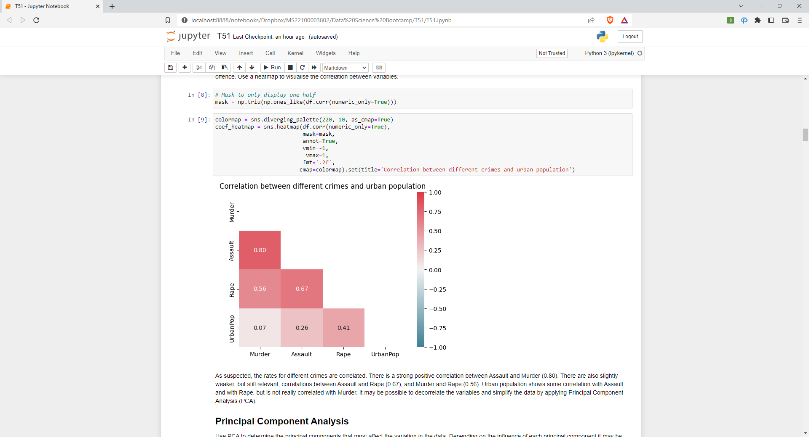

# Unsupervised Machine Learning Project
This is the last project I completed for the Hyperion Development bootcamp. This project demonstrates two different clustering
techniques: KMeans and hierarchical. This project also involves Principal Component Analysis (PCA). The data analysed for this
project is the US arrests dataset from Kaggle. The project aims to cluster similar states together and examine what the final
clusters have in common by using data analysis and visualisations.

## Installation
This project is written in Python and requires the following modules:
* Numpy
* Pandas
* Pyplot (from matplotlib)
* Seaborn
* Sci-kit Learn
* Scipy
The project file itself is a Jupyter Notebook file.

## Usage
The Jupyter Notebook file contains markdown and code cells. Details and explanations of each stage are given in the markdown cells.
A screenshot is shown below:

## Credits and acknowledgements
* The dataset used for this analysis is found on Kaggle. Click [here](https://www.kaggle.com/datasets/kurohana/usarrets) for more information and credits.
* Maps created using this website: [link](https://www.amcharts.com/visited_states/#)

## Future plans
In the future, I would like to display the clusters on a map created with Basemap from matplotlib, but this was out of the scope of the current project.